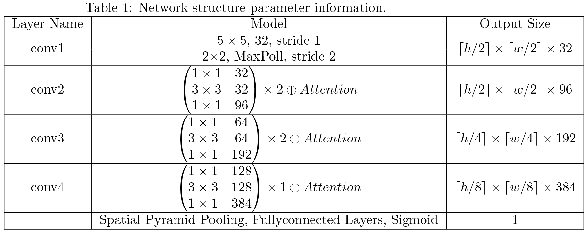

# WebShell Detection Based on Deep Residual Network

## Project Overview

The goal of this project is to detect WebShells, which are malicious script files hidden in web servers. 
Unlike traditional methods that rely on manual feature extraction and Natural Language Processing (NLP), we approach the problem from a computer vision perspective. 
We convert code files into grayscale images, where pixel brightness is determined by the ASCII values of the characters. 
Then, we use image processing techniques to classify the files as either malicious or benign.

Given the maturity of WebShell detection technologies, the focus of detection should be on highly obfuscated WebShells, which often obscure their malicious semantics. 
By converting the files into grayscale images and discarding semantic information, we can focus on identifying key patterns and unusual textures. 
This approach does not require designing separate feature extractors for different programming languages, addressing the limitations of previous methods.

The core architecture of the model is based on ResNet-50, enhanced with channel attention mechanisms, spatial attention mechanisms, and pyramid pooling techniques to improve detection accuracy.


## Before use
The project directory is organized as follows:
```
src/
├── codeImage/                       # Folder for grayscale images
│   └── php/                         # Folder for PHP WebShell images
│       ├── height32/                # Folder containing 32x128 grayscale images
│       ├── height64/                # Folder containing 64x128 grayscale images
│       └── ...                      # Other height folders
├── dataset/                         # Folder for the original WebShell dataset
│   └── php/                         # Folder for PHP WebShell files
│       ├── black/                   # Malicious (black) WebShell files
│       └── white/                   # Benign (white) WebShell files
├── models/                          # Folder for trained models
│   └── php/                         # Folder for models trained with PHP WebShell files
│       ├── height32/                # Folder for models trained with 32x128 images
│       ├── height64/                # Folder for models trained with 64x128 images
│       └── ...                      # Other height folders
├── fileToImage.py                   # Script to convert WebShell files to grayscale images
├── model.py                         # Script defining the ResNet based model
├── resnet_attention_webshell_php.py # Main training script
├── test_model.py                    # Script for testing the trained model
├── utils.py                         # Utility functions
├── requirements.txt                 # Python dependencies
└── README.md                        # Project description and documentation
```

This project is developed using Python 3.6.15. 
To ensure compatibility and install all the required dependencies, you need to create a virtual environment and install the necessary libraries by running:
```
pip install -r requirements.txt
```

## How to Use

This project uses PHP-based WebShells as an example. 
In practice, any script file can be converted into a grayscale image for training. 

### 1. Prepare the Dataset

You can download the WebShell dataset from [WebshellDetectDataset](https://github.com/HzieeC/WebshellDetectDataset). 
Place the "black" and "white" folders from a specific language in the `dataset` folder of this project. Run `fileToImage.py` to convert the files into grayscale images. For other datasets, modify the `in_dir` in `fileToImage.py` to the correct path of the malicious and benign datasets. The script will divide the dataset into training and testing sets with a 4:1 ratio. 
Additionally, you can adjust the `height` and `width` to choose the appropriate size for the grayscale images.

```
python3 fileToImage.py
```

### 2. Model and Training
The model architecture is defined in `model.py`, as shown in the diagram below:

In the second convolution layer (`conv2`), the convolution stride is set to 1, so there is no change in the scale. 
However, in the first residual block of each subsequent layer, the scale is reduced by a factor of 2 using a convolution with a stride of 2. 
The output layer uses pyramid pooling with sizes 1x1, 2x2, 3x3, and 4x4, followed by a sigmoid function to output the binary classification confidence.

Modify the dataset path and the corresponding grayscale image sizes in `resnet_attention_webshell_php.py`, and then run the script to train the model.

```
python3 resnet_attention_webshell_php.py
```

### 3. Model Testing
After each training epoch, the model's performance is evaluated on the test set. 
Additionally, you can modify and run `test_model.py` to test a specific checkpoint of the model:

```
python3 test_model.py
```

